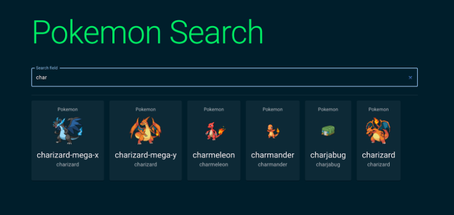

# Microsoft Reactor event Demo 7th September 2022



This is a simple demo application to showcase MongoDB Atlas and MongoDB Atlas Search.
In order to run this application, an account for MongoDB Atlas is needed. Sign up at:
https://www.mongodb.com/cloud

---

## MongoDB Atlas App Services
Atlas App Services provides a suite of managed cloud services including Atlas Device Sync, serverless cloud functions, declarative data access rules, and more. You can use App Services to write and host a full application in a managed cloud environment backed by MongoDB Atlas.   
https://www.mongodb.com/docs/atlas/app-services/

### AppServicesFunction.js
Main function to execute a MQL Aggregation Pipeline. Called each time the MongoDB App Services endpoint is accessed.

----

## Atlas Search
MongoDB's Atlas Search allows fine-grained text indexing and querying of data on your Atlas cluster. It enables advanced search functionality for your applications without any additional management or separate search system alongside your database.  
https://www.mongodb.com/docs/atlas/atlas-search/atlas-search-overview/

### autocompleteIndex.json
Index definition for MongoDB Atlas Search

```json
{
  "mappings": {
    "dynamic": true,
    "fields": {
      "name": [
        {
          "foldDiacritics": false,
          "maxGrams": 15,
          "minGrams": 2,
          "tokenization": "edgeGram",
          "type": "autocomplete"
        }
      ]
    }
  }
}
```

---

## Pokemon API
This is the data source for the demo:
https://pokeapi.co/

### getPokemons.js
Simple script to fetch 2000 pokemons from the API

---

## Pokemon-search
Main UI, built using React and MUI